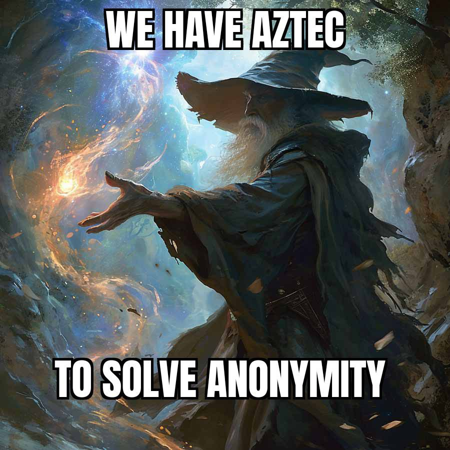
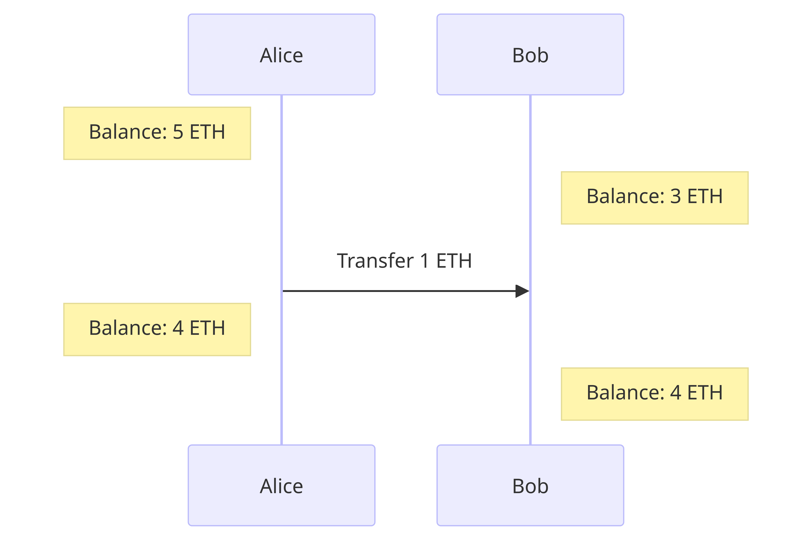
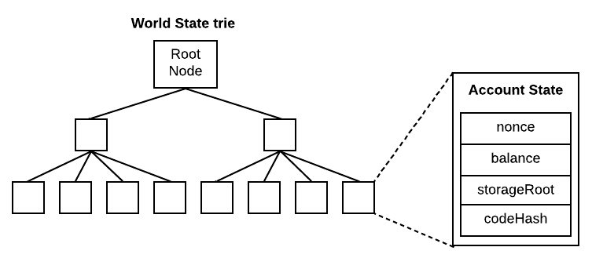
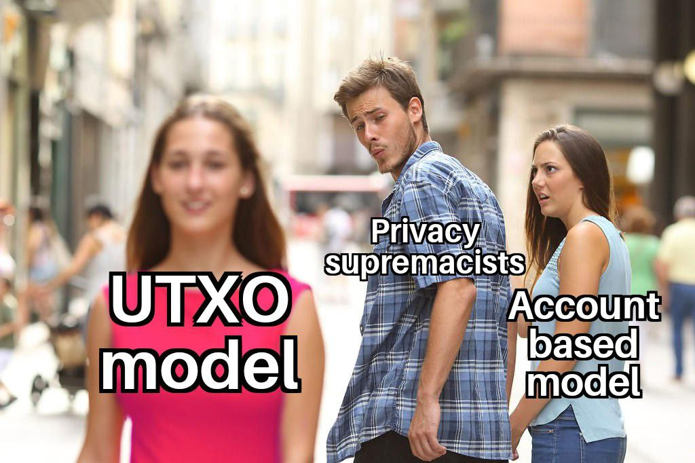
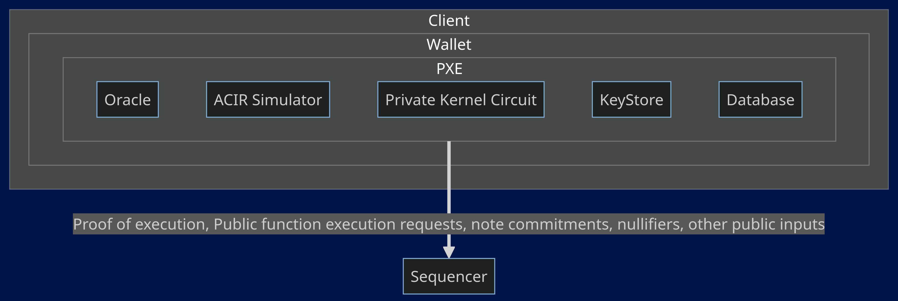
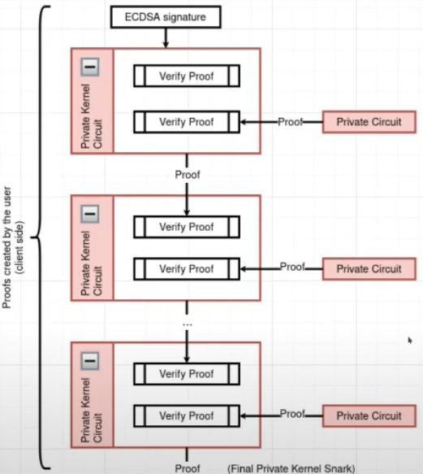
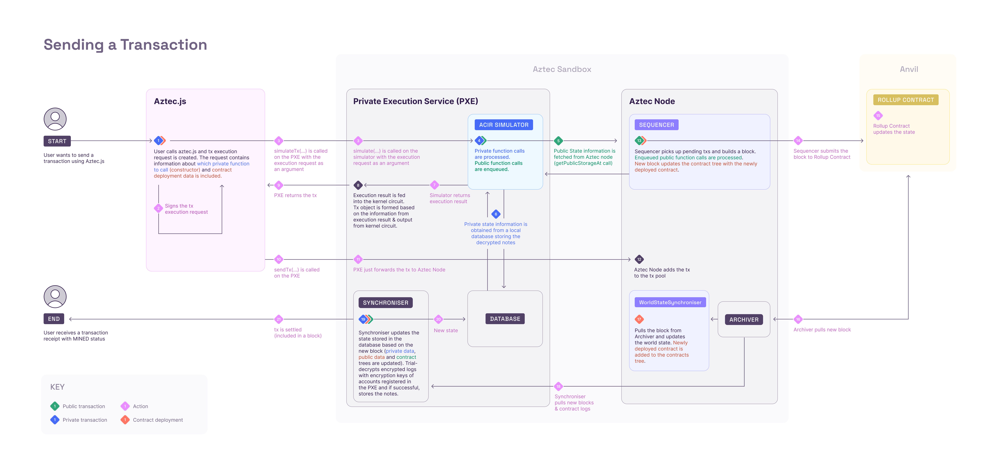
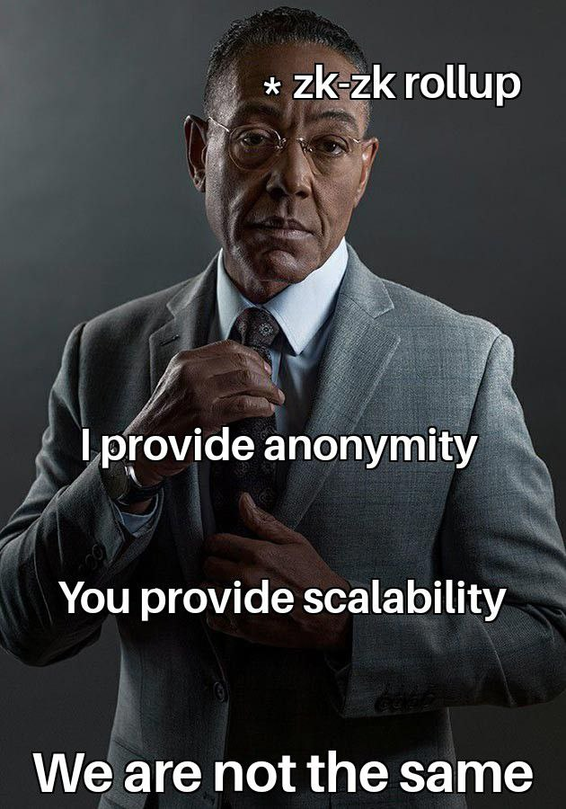

# Aztec Network: Zero to One!

In the burgeoning landscape of Layer 2 scaling solutions within the Ethereum ecosystem, an overarching emphasis has been directed towards enhancing scalability. This prevailing trend is particularly pronounced in the case of most of the [Zero-Knowledge Rollups (ZK-Rollups)](https://blog.thirdweb.com/zero-knowledge-rollups-zk/) and [Optimistic Rollups](https://www.alchemy.com/overviews/optimistic-rollups). Amidst this surge, there is a rollup in the town that focuses on the another most important, yet often overlooked, facet: **PRIVACY**.

  

While the majority of L2 solutions predominantly concentrate on optimizing transaction throughput and reducing fees, a notable alternative arises in the form of a privacy-centric rollup. This seeks to address privacy concerns associated with on-chain transactions. In contrast to scalability-centric solutions, where the primary goal is to process a higher volume of transactions efficiently, privacy-oriented rollups prioritize the confidentiality and anonymity of user activities on the blockchain.

Aztec is the privacy-preserving zk-rollup which aims at privatizing the user interactions using some amazing components which are in tandem help achieve the objectives of Aztec Network. We will see those components in a sufficiently detailed manner to help devs develop/build on top of Aztec Network.

  

# Why Aztec?

[Public blockchains](https://www.ledger.com/academy/glossary/public-blockchain) were primarily invented to transact (whether financial or non-financial) in permissionless, trustless, decentralised, and most importantly in transparent manner. But, the transparent nature of public blockchains seems to navigating back to the [cruel world](https://web.archive.org/web/20230315010940/https://www.forbes.com/sites/worldeconomicforum/2016/11/10/shopping-i-cant-really-remember-what-that-is-or-how-differently-well-live-in-2030/?sh=71c110b01735) from which the Bitcoin, as invented by Satoshi Nakamoto, and other blockchains followed by it are primarily intended to free us. Many [blockchain analytics companies](https://analyticsindiamag.com/top-blockchain-analytics-companies-and-what-they-do/) are there today to surveil the user interactions. Infact, it is absolutely possible to [trace back the user's real world identity](https://www.coindesk.com/consensus-magazine/2023/04/17/arkham-intelligence-cryptocurrency-blockchain-transparency/) because every user gets onboarded to crypto using a centralized exchange.  These analytics companies make use of this and do massive analysis of the open blockchain data and provide services to [governments](https://www.coindesk.com/tech/2020/11/04/digital-mercenaries-why-blockchain-analytics-firms-have-privacy-advocates-worried/), and other interested parties. 

As most user interactions are happening on Ethereum([$2.5 Trillions in volume as of March 2024](https://defillama.com/dexs/chains/ethereum)), it becomes the choke point for surveilling the mass amount of people. This is what Aztec tries to solve with its rollup technology.

# Architectural deep dive

Aztec in and itself has several groundbreaking stuffs that are worth exploring to stamp the **principle of anonymity** (not just pseudonomity) in the blockchain world. 

Lets just take a look at the big picture of Aztec Network before looking into them individually.

## Hybrid State Model

Lets talk about functions in a nutshell. A function takes in some arguments and updates the state.

$$f(state, x1, x2, ..,x_n)\ ->\ state'$$

For eg., when a `transfer` function is invoked, it takes in inputs `(from, to, value)` and updates the state by **incrementing** `recepient.balance` and **decrementing** `sender.balance`. 

  

When these state transition functions are public, there is no way to anonymously update the state. Aztec solves this by decoupling the private and public funtion calls, making a hybrid state model.

Private functions are called by users whereas public functions are called by [sequencers](##Sequencer). 

What does this mean??

It means now we can separate the private and the public state. Users account details are usually the private state.

## UTXO and Nullifiers

Lets think ourselves as to how we can proceed about building a privacy preserving zk-rollup. We will start from account. Ethereum uses account based model which is [EOA](https://ethereum.org/en/developers/docs/accounts/). Whenever a user transfers ETH, the user balance is decremented and the the recepient balance is incremented. Both of their balances are public. In order to achieve privacy, how can we do this increment/decrement operation in an anonymous manner? Well, you just can't. If the user and the receipient perform these operations locally, there is no way to verify it. If they are perfomed onchain, then it is open to everyone as ethereum maintains the public [state trie](https://ethereum.org/en/developers/docs/data-structures-and-encoding/patricia-merkle-trie/).

  

Enter Nullifiers!

Nullifier is a value used to nullify a certain other value. Not a good definition but it just explains its purpose. 

Lets say you have a $Note$ which can be used to spend upto 1ETH. Now, you are transferring 1ETH to a Defi protocol. And you have a $Note\ Commitment$ in the $Note\ commitment\ tree$ (we will talk about this later). You store the note commitment in the tree and not the plain note for maintaining privacy. To invalidate the note that you have spent in the Defi protocol, you add $Nullifier$ in the [Nullifier tree](https://docs.aztec.network/learn/concepts/storage/trees/main#nullifier-tree) which is<a href="#fn:1" rel="footnote">1</a>,

$$Nullifier = Hash(Note Commitment, secret key)$$
     
By adding this $Nullifier$ in the $Nullifier\ tree$, you basically **nullify the note**. Nice, but how double spending is avoided here? If you attempt to spend the note again, you will again have to create the $Nullifier$. The computed nullifier is added to the $Nullifier\ tree$ only if there is no nullifier of the same value in the tree. That is, only if non membership check is achieved, you can spend the note which is impossible if you try to spend it twice.
$$ \boxed{UTXO \text{ is accepted only if } Nullifier_{UTXO} \notin Nullifier Tree}$$

  

## PXE

Now we have ascertained a way to **update the state in an anonymous manner**. Next question is where that happens? Like, you cannot request a node or a [sequencer](##Sequencer) to update the private state by giving out your account data. That is just where we were before. You can't reap the benefits of the UTXO and Nullifiers duo in that case. We need a local user environment to do the private state transition.
          
This is why we have Private Execution Environment(PXE). PXE is where the private functions, and private state changes are executed. PXE can be either on server side or on client side. Aztec Network wallets will have an instance of PXE to perform client side operations on behalf. You can find the functionalities of PXE [here](https://docs.aztec.network/apis/pxe/interfaces/PXE). Now, we will deconstruct the PXE to understand it more.

  

- **ACIR Simulator:** This is responsible for simulating the transaction (private part of it) and generating partial witness (private inputs) and public inputs for private kernel circuits. It spins up an ACVM (Abstract Circuit Virtual Machine) for each function. 

- **Private Kernel Circuit:** This is responsible for generating the proof of execution of each private function recursively i.e., it verifies the previous function execution and generates proof for current function execution. This will end up with a single proof of whole private execution. This final proof is sent to the [sequencer](#sequencer) as you can see in the diagram above.

Here is the flow of how private kernel works:

  

ECDA signature, in the top of the flow, is when the user signs the transaction. First step of private kernel circuit is to verify that signature.

- **Database**: When user initiates a transaction, the user's (private) state is loaded from user's local PXE.

- **Oracle**: PXE also provides oracle functions for quering public data from a [sequencer](#sequencer). Some oracle functions can be found [here](https://github.com/AztecProtocol/aztec-packages/tree/master/noir-projects/aztec-nr/aztec/src/oracle).

- **Synchroniser**: Once the block (associated with the user transaction) is finalzied on L1,  then the synchroniser updates the user's PXE Database based on that new block.

- **KeyStore**: This is responsible for managing the user private keys.
 

## Sequencer

As we all have seen, once the user locally runs and generates the proof of execution for private functions and are verified by kernel private circuit, a single proof of whole execution, public function requests, and public inputs (New note commitments, nullifiers) are forwaded to sequencer for creating a transaction.

Then public funtions are executed as requested by the [PXE](##PXE) and the proofs of their execution are generated and verfied by kernel public circuit recursively as similar to kernel private circuit. Optionally, sequencer can delegate proof generation to prover network.

Generated proofs for each transaction are merged by Rollup circuits. It takes each transaction proof and generates a single proof in a [**'binary tree of proofs'**](https://docs.aztec.network/learn/concepts/circuits/rollup_circuits/main) topology while performing state updates, commitments and nullifier insertions, and membership checks for every transaction. You can read more about this [here](https://docs.aztec.network/learn/concepts/circuits/rollup_circuits/main).

Finally, the single proof (block proof) got submitted to L1 and is verified by the verifier contract in L1. In short, sequencers are just nodes with the capacity to create block proofs along with the block.

Here is the flow chart of a transaction lifecycle:

  

Aztec Network clearly distinguishes from other zk-rollups in every component of a rollup. They call it **zk-zk rollup**. Most of the ideas were inspired from ZCash protocol and Aztec is pretty happy to accept it. Its not only about who invents useful things. Its about who takes that and bring to the masses. Aztec is taking a hard path and looking to succeed in its mission. Huge applauds and respect to those who are willing to build on top of Aztec. Hail Aztec Ecosystem Devs!!

  

---
1. You can create nullifiers from hashing any values and not the ones mentioned in the example. That is, you can create custom nullifiers suited according to the case.